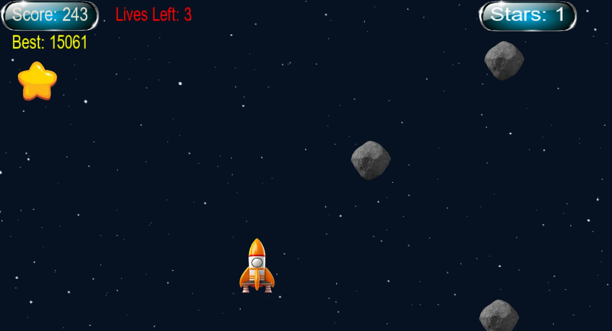
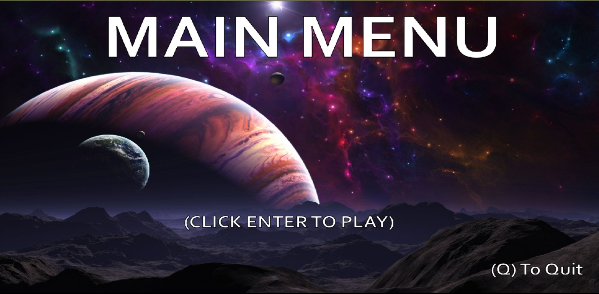
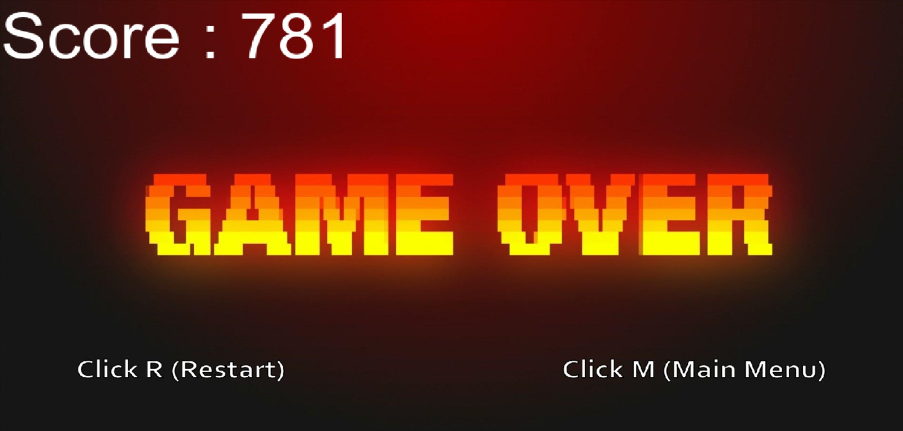

# 🎮 Mario ADSA

A 2D Mario-style game built using **C++** and **SDL2**, featuring custom rendering, audio management, collision detection, and interactive gameplay.

---

## 📸 Screenshots

### 🕹️ Gameplay



### 🧾 Scorecard



### 💀 Game Over Screen



---

## 🚀 Features

* 🎨 Custom Renderer (SDL2-based)
* 🔊 Audio Management System
* 🎮 Input Handling
* 💥 Collision Detection
* 📊 Score Tracking System
* 🧱 Modular Game Architecture

---

## 🛠️ Tech Stack

* **Language:** C++
* **Libraries:** SDL2, SDL2_image, SDL2_ttf
* **IDE:** Visual Studio (MSVC v143)

---

## 📂 Project Structure

```
Mario ADSA/
│
├── Application.cpp / .h
├── Renderer.cpp / .h
├── AudioManager.cpp / .h
├── CollisionManager.h
├── InputSystem.h
├── main.cpp
│
├── Pictures/
├── Sound/
├── SoundEffects/
├── Font/
│
├── gameplay.png
├── scorecard.png
├── gameover.png
│
└── Mario ADSA.sln
```

---

## ⚙️ Setup & Run

1. Clone the repository:

   ```bash
   git clone https://github.com/your-username/mario-adsa.git
   ```

2. Open the solution file:

   ```
   Mario ADSA.sln
   ```

3. Make sure SDL2 is properly configured:

   * Include paths
   * Library paths
   * DLLs in output directory

4. Build and run using Visual Studio

---

## 🎯 Controls

| Key        | Action |
| ---------- | ------ |
| Arrow Keys | Move   |
| Space      | Jump   |
| Esc        | Exit   |

---

## 📌 Notes

* Ensure SDL2 dependencies are installed before building
* Large audio/image assets can be managed using Git LFS if needed

---

## 👨‍💻 Author

**Anish**

---

## ⭐ Future Improvements

* Enemy AI
* Level system
* Save/Load functionality
* UI enhancements

---
